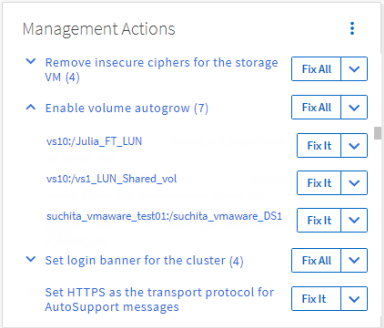

= Correção de problemas usando a correção automática do Unified Manager
:allow-uri-read: 
:icons: font
:imagesdir: ../media/

[role="lead"]
Há certos eventos que o Unified Manager pode diagnosticar minuciosamente e fornecer uma única resolução usando o botão *Fix it*. Quando disponíveis, essas resoluções são exibidas no Painel de instrumentos, na página Detalhes do evento e na seleção análise de carga de trabalho no menu de navegação à esquerda.

A maioria dos eventos tem uma variedade de resoluções possíveis que são exibidas na página de detalhes do evento para que você possa implementar a melhor solução usando o Gerenciador de sistema do ONTAP ou a CLI do ONTAP. Uma ação *Fix it* está disponível quando o Unified Manager determinar que há uma única resolução para corrigir o problema e que ele pode ser resolvido usando um comando CLI do ONTAP.

.Passos
. Para ver eventos que podem ser corrigidos a partir do *Dashboard*, clique em *Dashboard*.
+

. Para resolver qualquer um dos problemas que o Unified Manager pode corrigir, clique no botão *Fix it*. Para corrigir um problema que existe em vários objetos, clique no botão *corrigir tudo*.

Para obter informações sobre os problemas que podem ser corrigidos pela correção automática, link:..//storage-mgmt/reference_what_ontap_issues_can_unified_manager_fix.html["Quais problemas o Unified Manager pode corrigir"]consulte .
