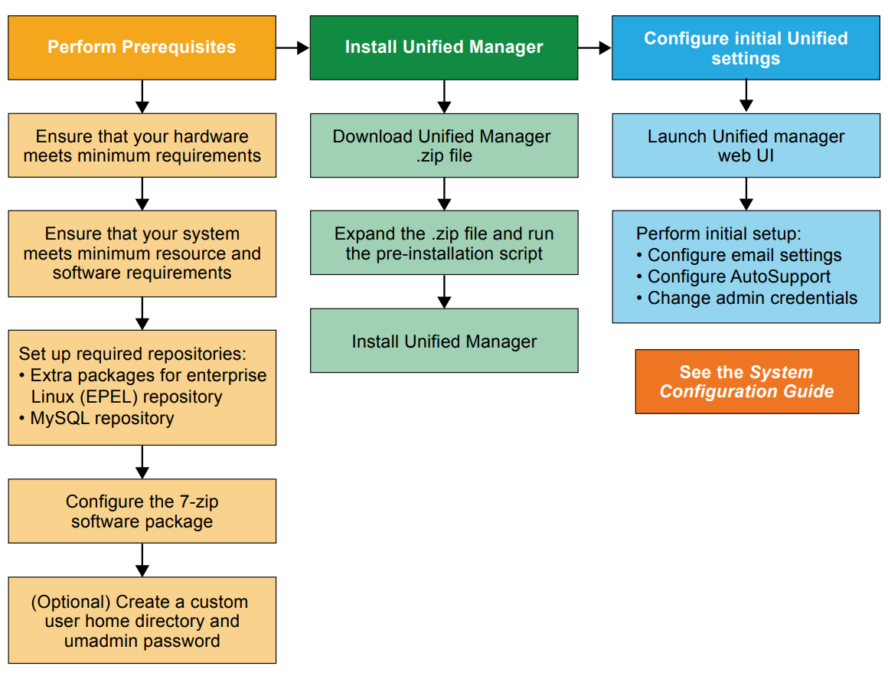

= Entenda a sequência de instalação do Active IQ Unified Manager no Red Hat Enterprise Linux
:allow-uri-read: 
:icons: font
:imagesdir: ../media/

[role="lead"]
O fluxo de trabalho de instalação descreve as tarefas que você deve executar antes de usar o Unified Manager.

